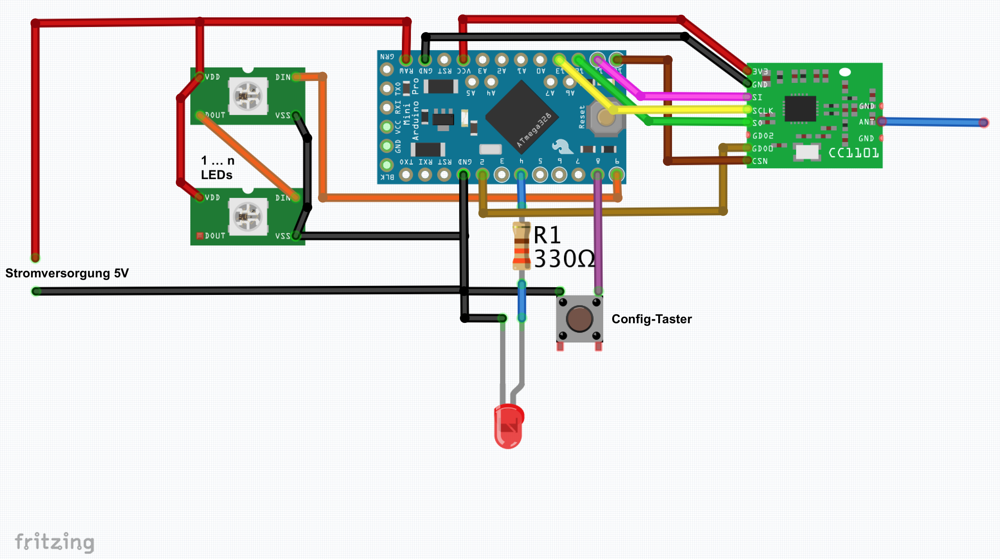
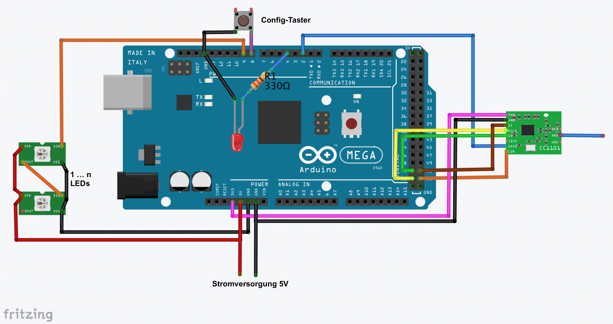
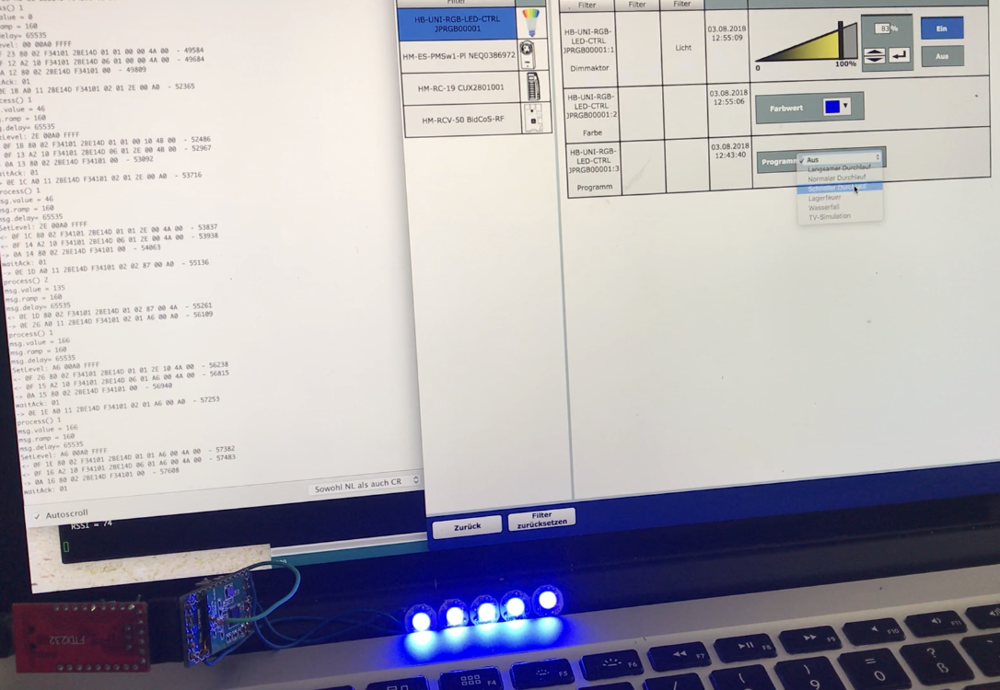

# HB-UNI-RGB-LED-CTRL
HomeMatic kompatibler RGB Controller für adressierbare RGB LEDs (WS28xx, Neopixel,...)

**Bis ca. 144 LEDs ist ein Arduino Pro Mini (3.3V / 8 MHz) ausreichend:**

**Bei > 144 LEDs ist ein Arduino Mega 2560 erforderlich:**

**Benötigte Libs:**
 - [FastLED](https://github.com/FastLED/FastLED)
 - [AskSinPP](https://github.com/pa-pa/AskSinPP)
   - sowie die dort aufgeführten [zusätzlichen Bibliotheken](https://github.com/pa-pa/AskSinPP#required-additional-arduino-libraries)
   
**Achtung: Bei Verwendung des Mega 2560 ist in eine [Modifikation](https://github.com/rocketscream/Low-Power/issues/30#issuecomment-336801240) in der Low-Power Bibliothek manuell vorzunehmen!**   

sowie auf der Zentrale (CCU2 / CCU3 / RaspberryMatic) das [JP-HB-Devices](https://github.com/jp112sdl/JP-HB-Devices-addon) Addon.
 
**Demo:**

